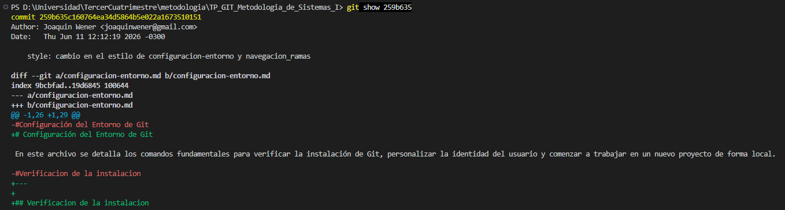
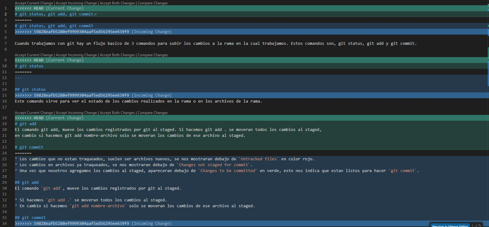

# 📊 Estadísticas del Repositorio

## 1. Integrante con mayor cantidad de commits
* **Comando utilizado:** `git shortlog -sn --all`
* **Resultado:** El integrante con mayor cantidad de commits fue **Joaquin Wener** con un total de **20** commits registrados.

## 2. Cantidad total de merges realizados
* **Comando utilizado:** `git log --merges --oneline`
* **Resultado:** Se realizaron un total de **18** merges.

## 3. Cantidad de conflictos producidos
* **Resultado:** Se produjo un total de **2** conflicto(s) a lo largo del desarrollo.

## 4. Cantidad de ramas existentes en el repositorio
* **Comando utilizado:** `git branch -a`
* **Resultado:** El repositorio cuenta actualmente con un total de **19** ramas (contabilizando tanto el entorno local como el remoto).

## 5. Commit con la mayor cantidad de archivos modificados
* **Comandos utilizados:** `git log --stat --oneline` (para buscar la métrica) y `git show 259b635` (para visualizar el diff).
* **Hash del commit:** `259b635`
* **Archivos involucrados:** **2** archivos modificados (`configuracion-entorno.md` y `navegacion_ramas.md`).
* **Captura del Diff:**

## 6. Captura de un conflicto previo a su resolución
* **Hash del commit asociado al conflicto:** `7f15a1a` (Commit de resolución del conflicto).
* **Captura del estado de conflicto:**
